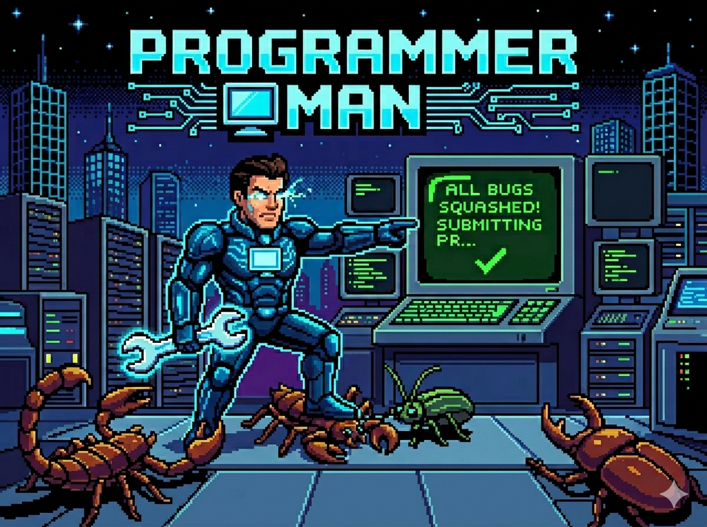
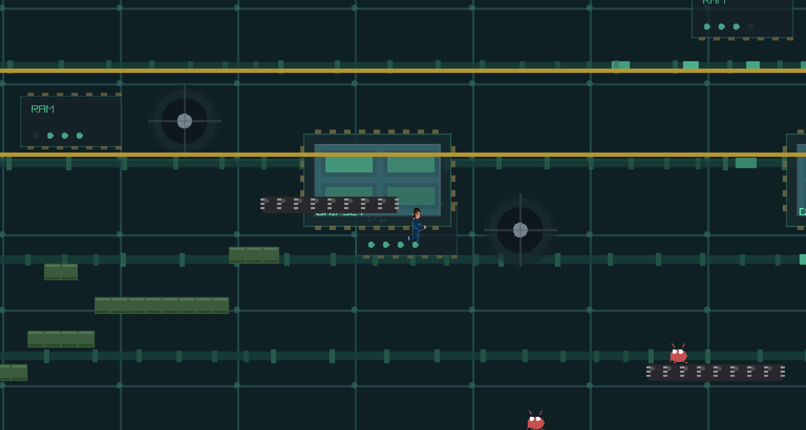

# Programmer_Man

A simple 2D platformer written in **Zig** using **raylib**.

## Overview

Programmer_Man is a retro-style platformer where you play as a programmer navigating the dangerous world inside a computer motherboard. Jump on bugs to squash them and earn points!

## Screenshots





## Features

- **Classic platformer mechanics**: Run, jump, and stomp enemies
- **Hardware-themed visuals**: PCB traces, chips, capacitors, and more
- **Bug enemies**: Patrol-type enemies that can be defeated by jumping on them
- **Moving platforms**: Horizontal and vertical platforms that carry the player
- **Scoring system**: +100 points per bug stomped
- **Lives system**: 3 lives with respawn on death
- **Opening screen**: Animated title screen with music before the first level

## Controls

| Action | Keys |
|--------|------|
| Move Left | `A` or `←` (Left Arrow) |
| Move Right | `D` or `→` (Right Arrow) |
| Jump | `Space`, `W`, or `↑` (Up Arrow) |
| Pause | `P` or `Escape` |
| Restart (after game over) | `R` |

## Controller Support (Windows — Wireless Controllers)

The game supports wireless controllers. For many DualShock/DualSense and clone controllers on Windows, using a small helper app (DS4Windows) to create a virtual XInput controller produces reliable input.

Quick setup (Windows):

1. Download DS4Windows from the official releases: https://github.com/Ryochan7/DS4Windows/releases
2. Run the installer or extract the portable ZIP and run `DS4Windows.exe`. When prompted, install the **ViGEmBus** driver (this is required to create a virtual XInput device).
3. Connect your controller via Bluetooth or USB. DS4Windows will present a virtual X360/XInput controller to Windows.
4. Calibrate the virtual controller (important):
    - Press `Windows+R`, run `joy.cpl` to open "Set up USB game controllers".
    - Select the DS4Windows virtual controller (e.g. "Controller (XBOX 360 For Windows") and click "Properties".
    - Click "Calibrate..." and follow the Windows calibration wizard. After finishing, click "Apply" to save the calibration.
5. Launch the game while DS4Windows is running. The game will detect the virtual controller and buttons/sticks should work as expected.

Notes:
- Steam Input can also be used to remap controllers on Windows if you prefer not to use DS4Windows.
- Keep DS4Windows running while playing so the virtual controller remains available.

## Gameplay Mechanics

### Movement
- **Run Speed**: 200 pixels/second
- **Gravity**: 1200 pixels/second²
- **Jump Impulse**: 450 pixels/second
- **Air Control**: 60% of ground acceleration
- **Variable Jump**: Release jump early for shorter jumps

### Combat
- Jump on bugs from above to stomp them
- Stomping gives you a small bounce (60% of jump height)
- Side or bottom collision with bugs = death
- Brief invincibility after respawning

## Building

### Prerequisites

1. **Zig**: Version 0.13.0 or later from [ziglang.org](https://ziglang.org/download/)

### Build Steps

```bash
cd tile-based-raylib-game
zig build
zig build run
```

### Web / Browser Build (WebAssembly)

Programmer_Man can additionally be compiled to WebAssembly and played in a browser.
This is an **additive** target — the native desktop build above is unchanged. See
[`docs/PM_BrowserGameplay.md`](docs/PM_BrowserGameplay.md) for the full phased plan.

> **Status:** **Phases 1–3 complete.** `build.zig` has a `wasm32-emscripten`
> branch and a `run-web` step; the source compiles end-to-end to
> `zig-out\htmlout\{index.html, .js, .wasm, .data}` (assets preloaded via
> `--preload-file assets@/assets`). Phase 2 fixed the case-sensitive asset paths
> (incl. the player sprite). Phase 3 confirmed a clean `wasm32-emscripten`
> compile and added runtime portability guards: the `WINDOW_RESIZABLE` config
> flag is now native-only (the web canvas is sized by the HTML shell/CSS in a
> later phase), and post-loop cleanup is documented as not running under
> `-sASYNCIFY`. The native desktop build is unchanged. Remaining: Phase 4 (audio
> unlock on gesture) and Phase 5 (custom HTML shell / hosting).

**Validated web toolchain:**

| Component | Version / location |
|-----------|--------------------|
| Zig | `0.13.0` (do **not** upgrade past 0.13 without bumping raylib-zig — the pinned `emcc.zig` uses 0.13-era build API) |
| raylib-zig | `v5.5` (already pinned in `build.zig.zon`; ships Emscripten support in `emcc.zig`) |
| Emscripten SDK | `3.1.50`, installed at `C:\Users\HP\emsdk` |

**One-time setup (Emscripten SDK):**

```powershell
git clone --depth 1 https://github.com/emscripten-core/emsdk.git C:\Users\HP\emsdk
cd C:\Users\HP\emsdk
.\emsdk.bat install 3.1.50
.\emsdk.bat activate 3.1.50
# verify:
.\upstream\emscripten\emcc.bat --version   # -> emcc ... 3.1.50
```

**Web build command.** Web builds pass Emscripten's path to Zig via `--sysroot`.
Use the `run-web` step to build and serve via `emrun` in one shot:

```powershell
zig build -Dtarget=wasm32-emscripten -Doptimize=ReleaseFast `
  --sysroot "C:\Users\HP\emsdk\upstream\emscripten" run-web
```

To build the artifacts **without** launching a server, drop the `run-web` step
(the default install step produces them):

```powershell
zig build -Dtarget=wasm32-emscripten -Doptimize=ReleaseFast `
  --sysroot "C:\Users\HP\emsdk\upstream\emscripten"
```

Output lands in `zig-out\htmlout\` (`index.html`, `.js`, `.wasm`, `.data`). Serve it
over HTTP — e.g. `emrun zig-out\htmlout\index.html` or
`python -m http.server` from that folder. Do **not** open via `file://` (the browser
must `fetch()` the `.wasm`/`.data`).

> The emcc link flags come from raylib-zig's `emcc.zig`:
> `-sUSE_OFFSET_CONVERTER -sFULL-ES3=1 -sUSE_GLFW=3 -sASYNCIFY -O3`. The `-sASYNCIFY`
> flag is what lets the existing blocking main loop run in the browser unchanged.

## Current Status

✅ **Playable & Integrated**: Core gameplay systems are implemented and playable. Raylib rendering is integrated — tilemap, background, player sprite, and procedural enemy/tile rendering all work.  
✅ **Audio**: SFX and music playback are supported and asset files are included under `assets/audio/` and `assets/music/`.  
✅ **Levels**: Four levels are provided as JSON (`level1.json`–`level4.json`) with a hardcoded fallback builder. Level 4 is "Silicon Ascent" — a vertical climb level.

### What's Implemented

- ✅ Player physics & movement (run, jump, coyote time, jump buffering, variable jump)
- ✅ Enemy AI (walker patrols and jumper behavior)
- ✅ Tile-based AABB collision and collision resolution
- ✅ Stomp mechanic, bounce, and scoring (+100 per stomp)
- ✅ Lives, health, respawn, and invincibility frames
- ✅ HUD (score, lives, health/status, game over UI)
- ✅ Level loading from JSON with a fallback builder (4 levels)
- ✅ Moving platforms (horizontal & vertical, carry player, per-level phase offsets)
- ✅ Hazards (falling sparks) and environmental interactions
- ✅ Camera with render-to-texture scaling, window resizing, and world-bounds clamping
- ✅ Graphics rendering (procedural tiles/enemies; player sprite support)
- ✅ Audio playback (SFX and music streaming)
- ✅ Parallax background and decorative elements
- ✅ Game states (opening screen, playing, paused, game over, victory/level-complete)
- ✅ Centralized input handling (`controls.zig`) — keyboard, XInput gamepad, and raw GLFW fallback for unmapped controllers

## Project Structure

```
tile-based-raylib-game/
├── build.zig           # Zig build configuration
├── build.zig.zon       # Package manifest
├── src/
│   ├── main.zig        # Entry point, game loop
│   ├── game.zig        # Game state management
│   ├── config.zig      # Game constants
│   ├── controls.zig    # Centralized input (keyboard, gamepad, raw GLFW fallback)
│   ├── player.zig      # Player physics & rendering
│   ├── enemy.zig       # Bug enemy AI
│   ├── tilemap.zig     # Level tiles & collision
│   ├── platform.zig    # Moving platform logic & player carry
│   ├── hazards.zig     # Environmental hazards (sparks)
│   ├── audio.zig       # Music + SFX playback
│   ├── background.zig  # Parallax/background effects
│   └── test_window.zig # Small test harness
├── assets/
│   ├── data/
│   │   ├── level1.json
│   │   ├── level2.json
│   │   ├── level3.json
│   │   ├── level4.json # "Silicon Ascent" — vertical climb level
│   │   └── tileset.json
│   ├── audio/
│   │   ├── jump.wav
│   │   ├── pounce.wav
│   │   └── stomp.wav
│   ├── music/
│   │   ├── lost_in_hyperspace.mp3
│   │   ├── danger_streets.mp3
│   │   └── lone_fighter.mp3
│   └── sprites/
│       └── player.png
└── docs/
    └── PRD.md          # Product Requirements
```

## Technical Details

### Tile System
- Tile size: 16x16 pixels
- Player size: 24x36 pixels (configured in `src/config.zig`)
- Screen: 800x600 pixels (50x37 tiles)

### Physics
- Fixed timestep at 60 FPS
- AABB collision detection
- Tile-based level collision

### Tile Types
- **Solid**: Basic platform tiles (PCB green)
- **Chip**: IC chip decorative platforms
- **Capacitor**: Capacitor decorative platforms
- **Trace**: Non-solid PCB decoration

## Phase 1 MVP Checklist

- [x] Player movement (run, jump)
- [x] Platform collisions
- [x] Basic physics (gravity, max fall speed, variable jump)
- [x] Enemy (bug) movement and patrol AI
- [x] Stomp-to-defeat mechanic with bounce
- [x] One playable level with hardware theme (JSON levels + fallback builder)
- [x] Basic rendering (procedural tiles & shapes; player sprite present)
- [x] Scoring system (+100 per stomp)
- [x] Lives and respawn system
- [x] Game over / Victory states
- [x] Pause functionality
- [x] Graphics rendering (raylib integration complete)
- [x] Audio playback (SFX and music)

## Future Enhancements (Post Phase 1)

- [ ] Expand sprite coverage and animations (enemies, tiles, VFX)
- [ ] More levels with progressive difficulty (beyond the included 4)
- [ ] Power-ups (speedboost, shield, etc.)
- [ ] Save/load system
- [ ] High score tracking and leaderboards
- [ ] Polish art, animations, and audio mix

## Code Statistics

- **~4.3k lines** of pure Zig game code
- **Zero external dependencies** (except graphics library)
- **Full physics simulation** with proper collision
- **Complete game loop** with state management
- **AI system** for enemy behavior
- **Modular design** for easy extension

## License

This project is licensed under the MIT License.

## Notes

Graphics, audio, moving platforms, and 4 complete levels are integrated. The game is fully playable end-to-end. Next work: art/animation polish, additional levels, balancing, and additional features listed above.